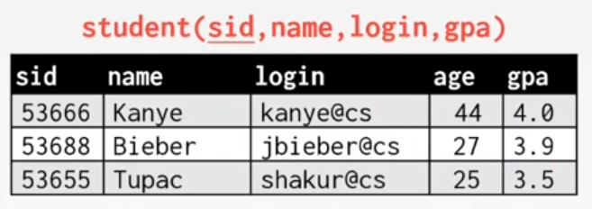
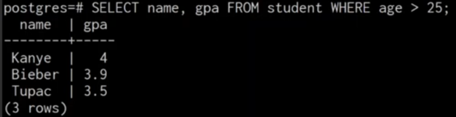
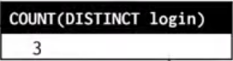
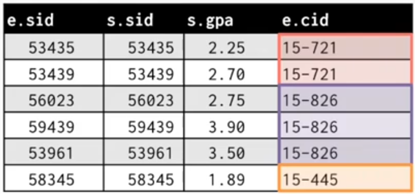
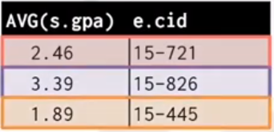
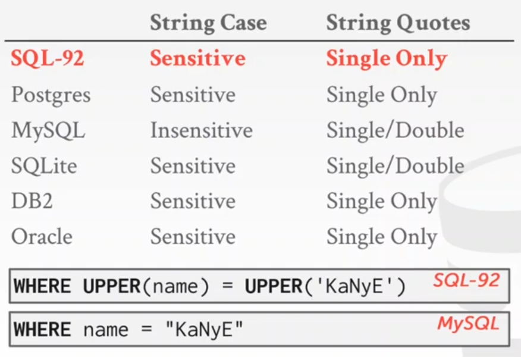
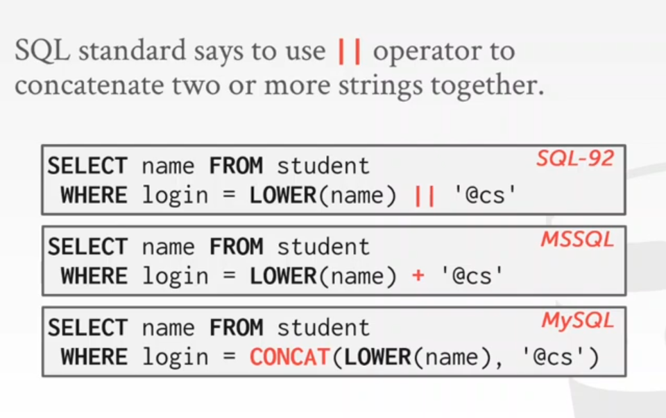
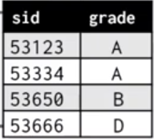
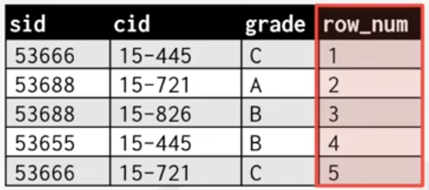
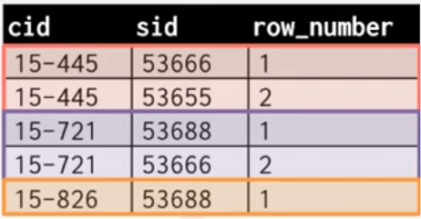

# intermediate SQL

## SQL History 
IBM's first query language wwas called "SQUARE" 
developed in 1974 as "SEQUEL" for IBM System T prototype DBMS  
 
IBm=N relesases commercial SQL-based DBMSs in (1981) and DB2 (1983 )
Current standard is SQL:2016
SQL:2016 -> JSON, Polymorphic tables
SQL:2011 -> Temporal DBs, Pipelined DML
SQL:2008 -> Truncation, Fancy Sorting 
SQL:2003 -> XML, Windows, Sequences, Auto-Gen IDs.
SQL:1999 -> Regex, Triggers, OO

## Relaional Languages 
 
Data Manipulation Language (DML)
Data Definition Language (DDL)
Data Control Language (DCL)

SQL is based on **bags** (duplicates) not **sets** (no duplicates).


## From Next Table



## Basic Syntax 

``` sql
SELECT column1, column2, ... 
FROM table-name
WHERE predicate1, predicate2, ... 
-- as an example 
SELECT name, gpa 
FROM student 
WHERE age > 25 
```
SELECT  operation is equal to  **$\pi_{name, age}$ (Projection)**
WHERE operation is equal to **$\sigma_{age> 25}$ (Selection)**
 **The Result will be** 



## Basic Syntax :JOINS

for example we want to know which students got an A in 15-721

``` Sql
SELECT s.name
    FROM enrolled AS em su=tudent AS s
WHERE e.grade ="A" AND e.cid ='15-7210'
    AND e.sid = s.sid
```


## AGGREGAATES

Function that return a single value form a bag of tuples:
- AVG(col) == Return the average col value.
- MIN(col) == Return minmum col value.
- MAX(col) == Return maximum col value.
- SUM(col) == Return sum of values in col.
- COUNT(col) == Return Number of values for col.

The Aggregate function can (almost) only used in the SELECT  output list.

Get # of students with a "@cs" login:
``` sql
SELECT COUNT(login) As cnt
    FROM student WHERE login LIKE '%@CS'
```
"%" sempol in SQL used to search for patern

**MULTIPLE AGGREGATAES**

get the number of surdents and their aversage GPA that have a "@cs" login.

``` sql
SELECT AVG(gpa), COUNT(sid)
    FROM student WHERE login LIKE '%@cs'
```
 **The Result will be** 


**DISTINCT AGGREGATAES**

COUNT, SUM, AVG support DISTINCT 
Get the number of unique students that have and "@cs" login.

```sql
SELECT COUNT(DISTINCT login)
    FROM student WHERE login Like '%@cs'
```
 **The Result will be** 


## GROUP BY 

Project tuples into subsets and calculate aggregats against each subset.
``` sql
SELECT AVG(s.gpa), e.cid 
  FROM enrolled AS e, student AS s 
 WHERE e.sid = s.sid
 GROUP BY e.cid
```
**we will make a join grouped by course id befor we claculate the avg** 





> Non-aggregated values in SELECT output clause maust appear in GROUP BY clause.


## HAVING 
 
Filters results bassed on aggregation computation.
Like a WHERE clause for a GROUP BY 

```SQL
SELECT AVG(s.gpa) AS avg_gpa, e.cid
  FROM enrolled AS e, student AS s
 GROUP BY e.cid
 HAVING AVG(s.gpa) > 3.9;
-- the avg_gpa will be 3.950 for the e.cid 15-721
```

## STRING OPERATIONS 



Standerd is that string matching are case **insensitve** and using only **single quates**

`LIKE` Is used for string matching 

**String-matching operators**
- '%' matches any substring(including empty strings).
- '_' Match any single character.
- '_ _ _' matches any string of exactly three characters.
- '_ _ _ %' matches any string of at least three characters.

```sql
SELECT * FROM enrolled AS e 
 WHERE e.cid LIKE '15-%';

SELECT * FROM student AS s 
 WHERE s.login LIKE '%@c_'

```

In SQL-92 defines string functions.
    many DBMSs also have their own unique functions 

``` sql
-- can be used in either output and predicates:

SELECT SUBSTRING(name,1,5) AS abbrv_name
 FROM student WHERE sid = 53688;

SELECT * FROM student AS s 
 WHERE UPPER(s.name) LIKE 'KAN%';

```




**DATE/TIME OPERATIONS**

Operation to manipulate and modify DATE/TIME attributes.
Can be used in both output and predicates.
 
`SELECT NOW();` gaves us the current date
other function that gaves us current date and time $_{may work in some and don't work in onother}$ `SELECT  CURRENT_TIMESTAMP();` , `SELECT CURRENT_TIMSTAMP;`
Some SQL date function to get the diff between two days
`SELECT ROUND((UNIX_TIMESTAMP(DATE('2021-09-01')) -UNIX_TIMESTAMP(DATE('2021-01-01')))/ (60*60*24),0); `,
`SELECT DATEDIFF(DATE('2021-09-01'),DATE('2021-01-01')) AS days;` 

## OUTPUT REDIRECTION

Stor query result in another table:
- table must not already be dfined.
- teble will have the smae # of columns with the same types of the input.

``` sql
SELECT DISTINCT cid INTO courseIds 
 FROM enrolled; 
--  SQL-92
```

``` sql
CREATE TABLE courseIds (
SELECT DISTINCT cid  FROM enrolled);
--  MySQl
```

## OUTPUT CONTROL 
- **ORDER BY** <column*> [ ASC | DESC ]

    Order the output typles by the values in one or more fo thier columns.

    ```sql
    SELECT sid, grade FROM enrolled
    WHERE cid = '15-721' 
    ORDER BY grade;
    --  you can make it ORDER BY 1
    ```
    


- **LIMIT** <count*> [offset]

    - Limit the Number of tuples returned output 
    - Can set an offset to return a 'range'


    ```sql

    SELECT sid, name FROM student 
    WHERE login LIKE '%@CS'
    LIMIT 10;

    -- TO GET THE NEXT 10 YOU CAN USE THIS  

    SELECT sid, name FROM student 
    WHERE login LIKE '%@CS'
    LIMIT 20 OFFSET 10;

    ```
## NASTSED QUERIES

Queries containing other queries.
They are often difficult to optimize.
> inner queries can appear  (almost) anywhere in query.

```sql
SELECT name FROM student WHERE 
sid IN (SELECT sid FROM enrolled);

```
another example 
Get the names of students in '15-445'

```sql
SELECT name FROM studet 
 WHERE sid IN (
    SELECT sid FROM enrolled 
     WHERE cid = '15-445'
 );

```
**different operators in nasted queres**
**ALL** => Must satisfy expression for all rows in the sub-query.

**ANY** => Must satisfy expression for at least one row in the sub-query.

**IN** => Equivalent to ' = ANY()'.

**EXIST** => At least one row is returned.


## WINDOW FUNCTIONS

Performs a "sliding" calculation across a set of tuples that are related.
Like an aggregation but tuples are not grouped into a single output tuples.

```sql
-- syntax
SELECT ..FUNC-NAME(..) OVER(...)
 FROM table-name
--  FUNC-NAME REFERS TO AGGREGATION FUNCTIONS SPCIAL FUNCTIONS
--  OVER FUNCTIO REFERS TO HOW HO "SLICE" UP DATA , CAN ALSO SORT 
```
**SPECIAL WINDOW FUNCTION**
- ROW_NUMBER() => number of the current row
- RANK() => Order position of the current row.

```sql
SELECT *, ROW_NUMBER() OVER() AS row_num 
 FROM enrolled ;

```
**The ouput will be like**


The `OVER` keyword specifies how to group together typles when computing the window function.
Use PARTITION BY yo specify group 

```sql
SELECT cid, sid,
   ROW_NUMBER() OVER (PARTITION BY cid)
  FROM enrolled
 ORDER BY cid;

```


another example 
*Find the student with the second highest grade for each course.*

```sql
SELECT * FROM (
    SELECT *, RANK() OVER(PARTITION BY cid
         ORDER BY grade ASC) AS rank
   FROM enrolled) AS ranking 
  WHERE ranking.rank =2;

```
 
