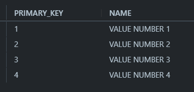
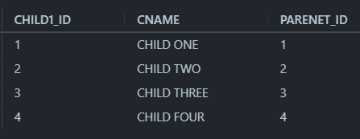
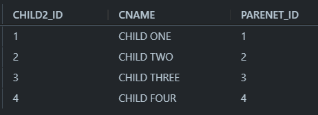
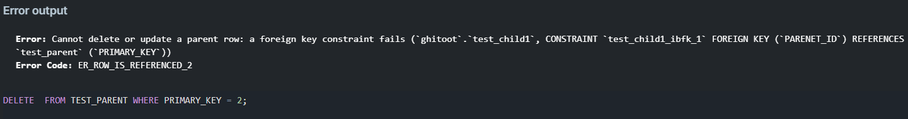

# Database mangement system (DBMS)

**DBMS** is a collection of programs that enables users to create and maintain a database 

**DBMS** is a genral-purpose software sytem that facilitates the processes of **defining** , **construction** , **manipulating**, and **sharing** database among various users and applications .


> **Defining** a database involves specifying the data types, structures, and constraints of the data to be stored in the database. the database definition or descriptive information is also stored by  the DBMS in the form of a database catalog or dictionary; it is called **meta-data.**


> **constructing** the database is the process of storing the data on some **storage medium** that is controlled by the **DBMS**


> **Manipulating** a database includes functions such as **querying** the database to **retrieve specific data**, **updating the database** to reflect changes in the **miniworld**, and generating reports from the data.


> **Sharing** a database allows multiple users programs to access the database **simultaneously.**


an application program accesses the database by **sending** **queries** or **requess** for data to the DBMS **Query** typically causes some data to be retrieved 

>**Entity** what we store the data about
>
>**Attribute** that data we stored about the entity

## SQL 
Structured Query Language (SQL) uses to define the database structure (DDL -DATA DEFINE LANGUAGE), then manipulate the data (DML -DATA MANIPULATE LANGUAGE )

**Transaction**  may couse some data to be read and some data to be written into the database 

> one of the most important function of DBMS is **protection** the database and **maintaining** it over a long period of time.


> **Portection** includes system protection against hardware or software malfunction (or crashes) and security protection against unauthorized or malicius access


A typical latge database may have a lifecycle of many years, so the DBMS must be able to **maintain** the database system by allowing the system to evoleve as requirments change over time.


## RDBMS 
**view mechnmism :** allows us to create different views 

## Data Abstraction 
For the system to be usable, it must retrieve data efficiently
- physical level
- logical level 
- view level

## Instances and Schemas
Databases change over time as information is inserted and deleted. The collection of information stored in the database at a particular moment is called **Instance** of the database (snapshot of data). The overall design of the daatabase is called the database **Schema** (the logical design of the database)

Database systems have seversal schemas, partitioned according to the levels of abstraction.
- **Physical schema** describes the database design at the physical level
- **logical schema** describes the database design at the logical level 

A database also may have several schemas at the view level sometimes it called **subschema** 

## NOTES

> primary Key can't change but foreign  key can by changing the reference of it 


****

When we create a foreign  key we can use on of this keywords to keep our database stable if we delete user whose primary key is a foreign  key in another table
**`ON DELETE` , `ON UPDATE`**
It can take options like `SET NULL`, `CASCADE`, `RESTRICT` 


**RESTRICT**


If we use `ON DELETE RESTRICT` it will give us an error because we can't have a null value to a foreign  key so the parent won't be deleted 

If we use `ON UPDATE RESTRICT` it will do nothing if we update the id of user 
```sql
    -- I CREATED 3 TABLES TO CLEARFY THE RESULT 
    CREATE TABLE TEST_PARENT(
    PRIMARY_KEY INT PRIMARY KEY ,
    NAME VARCHAR(30)
);

CREATE TABLE TEST_CHILD1(
    CHILD1_ID INT PRIMARY KEY,
    CNAME VARCHAR(30),
    PARENET_ID INT ,
    FOREIGN KEY (PARENET_ID) 
    REFERENCES TEST_PARENT(PRIMARY_KEY) ON DELETE RESTRICT
);


CREATE TABLE TEST_CHILD2(
    CHILD2_ID INT PRIMARY KEY,
    CNAME VARCHAR(30),
    PARENET_ID INT ,
    FOREIGN KEY (PARENET_ID) 
    REFERENCES TEST_PARENT(PRIMARY_KEY) ON UPDATE RESTRICT
);
DROP TABLE TEST_CHILD;

INSERT INTO  TEST_PARENT VALUES(1,"VALUE NUMBER 1");
INSERT INTO  TEST_PARENT VALUES(2,"VALUE NUMBER 2");
INSERT INTO  TEST_PARENT VALUES(3,"VALUE NUMBER 3");
INSERT INTO  TEST_PARENT VALUES(4,"VALUE NUMBER 4");

INSERT INTO TEST_CHILD1 VALUES(1,"CHILD ONE", 1);
INSERT INTO TEST_CHILD1 VALUES(2,"CHILD TWO", 2);
INSERT INTO TEST_CHILD1 VALUES(3,"CHILD THREE", 3);
INSERT INTO TEST_CHILD1 VALUES(4,"CHILD FOUR", 4);

INSERT INTO TEST_CHILD2 VALUES(1,"CHILD ONE", 1);
INSERT INTO TEST_CHILD2 VALUES(2,"CHILD TWO", 2);
INSERT INTO TEST_CHILD2 VALUES(3,"CHILD THREE", 3);
INSERT INTO TEST_CHILD2 VALUES(4,"CHILD FOUR", 4);

-- FIRST THE RESULT OF THE 3-TABLES

SELECT * FROM TEST_PARENT;
SELECT * FROM TEST_CHILD1;
SELECT * FROM TEST_CHILD2;

```




```sql
-- IT WILL SHOW US THE THAT ERROR IN ANY CASE OF THE TWO UBOVE  FOR EXAMPLE

DELETE  FROM TEST_PARENT WHERE PRIMARY_KEY = 2;
-- THIS ID HAS FORGIN KEY IN POTH CHILD TABLES(ONE IS ENOUGH)

```


****

**CASCADE**

Cascade simply means whatever happend to the parent(table) happens to the chile(table)
so if we *delete* date from parent the row will *deleted* form child as well
and if we *update* the value in parent it will be *updated* in child as well

****

**SET NULL**
if we use `ON DELETE SET NULL` OR `ON UPDATE SET NULL` it means the children will have a null value 
what if the child can't be null (had `NOT NULL` or the foreign  key is a composite primary key in another table) the parent couldn't be deleted or update

****

**simple key** 
it means primary key consists of one column "Most natural key"
**composite key**
it means primary key consists of two or more columns 
**compound key** 
it is a composite key (consists of two or more columns) but both are foreign  key and both(if they were two 😅) represent the primary key means that combination can't be repeated 

****

**You Can Look Here To Understand Superkey [javapoint](https://www.javatpoint.com/super-key-in-dbms)**

**Candidate Key**
is a subset of super key it has the same purpose of primary key (both uniquely identify the tuples and both can't be null) but we can have more than candidate key and we can create only one primary key

**Alternate Key**
An alternate key is none other than a candidate key. It means an alternate key is also used to identify those columns in a table that can uniquely identify all the records of the table

> remeber relation is a table relationship is a connection between two tables

## introduction to database normaalization

it means correcting data integrity problem in our database 
there are 3 ways to follow to reach normal form and a good designed database

****
**First Normal Form Of Database Normalization**
this normal form required data to be atomic

example of data not being atomic like if we have a 
*column* 
that required two more intity like a composite attribute which can be more one attribute like name (can be fname and lname)
or address(can be home number , street no, state and city)
or *multi_attribute*
like if someone insert two mails in mail category 
or *duplicated_data*
like if we separete two mails of same person with different IDs (but same name and same all data "different is id and email only or any something like that")


**Soluation**
Break-off the problem column into more colums and use more attrubites for multi_attributes

****
**Second Normal Form Of Database Normalization**
Known as a partial dependancy
dependancy can be show as an entity and its attributes like student_id and student_name or phone etc..
it happens on M-N relationship(Many to many relationship). if we hava a M-N relationship we break it into two 1-N relationships(one to many relationship) through the intermediate table or join table 
in intermediate tables or join tables our primary key is two foreign  keys so the attribute of any parent is a partial dependance to intermediate table 
For example
if we have an outher and a book the relation is M-N so we have to create intermediate table called outher_book and it'll takes the outher_id and book_id as a composite primary key 
in outher table we have attributes like outher id, name , bd and age ..etc and all of that depen on outher_id (the only primary key)
if the attribute outher age were in auther_book table which have auther_id and book_id both as a primary key it will depend only on outher_id(auther age had nothing to do with book_id 🤷)
so it called a partial dependancy

**Soluation**
remove all partial dependancy and bring it back to the right table

****
**Third Normal Form Of Database Normalization**
it deals with transit dependency 
if we have an attribute depends on onther attribute(won't affected by primary key) which depends on the primary key
For example if we have review table and the attributes in that table will be like review_id,
star, star-meaning, user_id and product_id etc..
here star is a value or number and star meaning depends on it to be verybad, bad, good, verygood 
here star-meaning is a transit dependency and it dosn't depend on the primary key directly 

**Soluation**
remove all the transit dependeny into another tabel in our case we create a star table and the table attributes will be star_id, star,star_meaning etc..

****

## Clustered, Nonclustered and Composite indexes
**Clusterd**
organise the actual data it usually faster in searching with id or index
**Nonclustered**
points to the data its easier when searching with name
****

## JOINS
you can see it in SQL NOTES From here [joins](../SQL%20Tutorial/SQL%20NOTES.md#JOINS)

****


