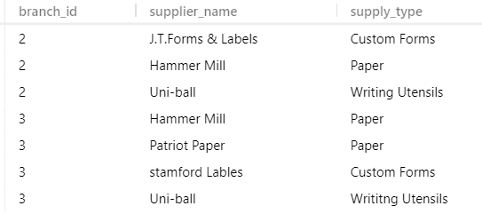
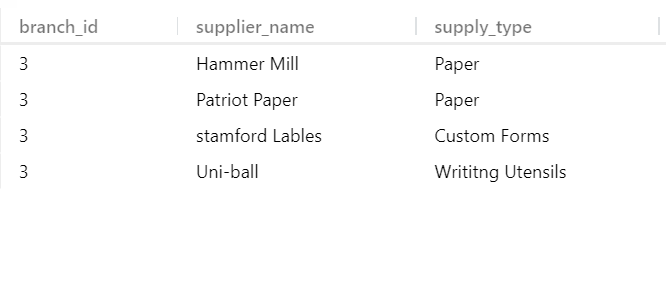

# QUERIES

## POP SQL Programm
 you need to download pop sql to visually manage your sql database (relational database)

## Basic data types in SQL language

- **INT**                --WHOLE NUMBERS
- **DECIMAL (M,N)**      --DECIMAL NUMBERS -EXACT VALUE
- **VARCHAR(1)**         --STRING OF TEXT LENGHT 1
- **BLOB**               --BINARY LARGE OBJECT, STORES LARGE DATA
- **DATE**               -- 'YYYY-MM-DD'
- **TIMESTAMP**          -- 'YYYY-MM-DD  HH-MM-SS' USED FOR RECORDING 

## CREAT TABLE IN DATABASE
 
``` SQL
CREATE TABLE table-name(
    columnName DATATYPE,
    columnName DATATYPE,
    columnName DATATYPE
);
-- FOR EXAMPLE
CREATE TABLE student(
    student_id INT ,
    /* WE CAN MAKE IT PRIMARY KEY WHEN ADDINIG A COLUMN LIKE THAT
    studint_id INT PRIMARY KEY,
    OR WE CAN USE 
    PRIMARY KEY(student_id)
    */
    name VARCHAR(30),
    major VARCHAR(20),
    GPA DECIMAL(3, 2),
    PRIMARY KEY(student_id)
);

```
we can run use this query to show a description of a tabel  `DESCRIBE tableName;`

## Delete Table form database 

**We simplly uses this command**
``` sql
DROP TABLE tableName;
-- example
DROP TABLE student;
/*
    it will drop the student table 
*/
```
> in POP SQL  program if we clik on any query it gets highlighted and we can run the hilghlghted query from the run botton 

as shown down


## Modifay Table

```sql 
/*
    IF YOU WANT TO MODIFAY ALTER KEYWARD 
    FOR ADDING WE USE 

    ALTER TABLE tableName ADD columnName DATATYPE;

    FOR EXAMPLE

*/

ALTER TABLE student ADD email VARCHAR(30);

/*
    FOR DROPPING THAT COLUMN WE USE
    ALTER TABLE tableName DROP columnName;
*/

ALTER TABLE student DROP email;


```
## Inserting Data To Table

```sql 
/*
    we use INSERT KEYWORD to insert some data into table 

    INSERT INTO tableName VALUES(
        "We but data with its order in the table"
            );
    
    for example

*/
INSERT INTO student VALUES(1,'Jack','ECE',3.70);
-- IF WE HAVE COLUMN THAT MIGHT BE EMPTY 
-- OR HAVA A NULL VALUE WE CAN USE THIS
INSERT INTO student(student_id,name) VALUES (2,'John');
-- we will get no error and a null value in gpa and major columns

```
> You can use constrains like  `NOT NULL` to make sure that the coulmn you choose won't have an NULL value ,and `UNIQUE` for making the colmn refuses the value that can't be duplcatied like email and user_id or SSN 

```sql
/*
    if we want to add a column with a default value we can ues keyword DEFAULT 'vlaue'

    also we can use keyword AUTO_INCREMENT with id
    without need to write it evey time 

    for example

*/

CREATE TABLE student(
    student_id INT  AUTO_INCREMENT,
    name VARCHAR(30),
    major VARCHAR(20) DEFAULT 'Undecided',
    PRIMARY KEY(student_id)
);

INSERT INTO student(name, major) VALUES ('Mohamed','CSE');
INSERT INTO student(name, major) VALUES ('Ahamed','BIO');
INSERT INTO student(name, major) VALUES ('SARA','CME');
INSERT INTO student(name, major) VALUES ('Anas','MTE');

```

the output shown down


## UPDTAING AND DELETING

```SQL
/*
    updating using the keyword UPDATE 
    if we want to change the name of the CME 
    'don't know is that ^_^' to PDE in that last tabel 
*/

UPDATE student SET major = 'PDE' 
  WHERE major = 'CME';
```


## advance example of database 
**we will build this schema**


```sql

/*
we first add the emloyee table like that without 
idntfy the forign keys
because there is no other 
tables yet so we can't do that know

*/

CREATE TABLE employee (
    emp_id INT PRIMARY KEY,
    first_name VARCHAR(30),
    last_name VARCHAR(30),
    birth_day DATE,
    sex VARCHAR(1),
    salary INT,
    super_id INT,
    branch_id INT
);

```
> while adding a forgin key we use the following way 
`FOREIGN KEY (forgin_key_name) REFERENCES [Table_name] ON DELECTE NULL`
to make it null if the data of other tabel deleted 

``` sql
/*
Then we add second table with forgin key which refers to the first one
*/
CREATE TABLE branch (
    branch_id INT PRIMARY KEY,
    branch_name VARCHAR(30),
    mgr_id INT ,
    mgr_start_date DATE,
    FOREIGN KEY (mgr_id) REFERENCES employee (emp_id) ON DELETE SET NULL
);
/*
    now we set the bracnh table we can add branch id in employee id as
    a forgin key and supervisor id too

*/

ALTER TABLE employee
ADD FOREIGN KEY (branch_id)
REFERENCES branch(branch_id)
ON DELETE SET NULL;

ALTER TABLE employee
ADD FOREIGN KEY (super_id)
REFERENCES employee(emp_id)
ON DELETE SET NULL;

/*
    now we can add the clinent table 
*/

CREATE TABLE client (
    client_id INT PRIMARY KEY,
    client_name VARCHAR(30),
    branch_id INT ,
    FOREIGN KEY ( branch_id) REFERENCES branch (branch_id) ON DELETE SET NULL
);

/*
    after client table we will creat works_with table which has composite key 

    the way we add a composit key as primary key
    PRIMARY KEY (first_key,Second_key),


*/

CREATE TABLE works_with (
    emp_id INT,
    client_id INT,
    total_sales INT ,
    PRIMARY KEY (emp_id,client_id),
    FOREIGN KEY (emp_id) REFERENCES employee (emp_id) ON DELETE CASCADE,
    FOREIGN KEY (client_id) REFERENCES client (client_id) ON DELETE CASCADE
);
 
 /*
    Then we add last table we have brach_supplier table 

 */

CREATE TABLE branch_supplier (
    branch_id INT,
    supplier_name VARCHAR(30),
    supply_type VARCHAR(30),
    PRIMARY KEY (branch_id,supplier_name),
    FOREIGN KEY (branch_id) REFERENCES branch (branch_id) ON DELETE cascade
);


```

**Now we finish our tables so we can start fill data**

```sql
-- corporate
INSERT INTO employee VALUES(100,'David', 'Wallace', '1967-11-17', 'M', 250000, NULL , NULL);
-- We Should Make Bracnh_id = 1 but it hasn't created yet so we make it null untill we add it 
INSERT INTO branch VALUES(1, 'Corporate', 100, '2006-02-09');
-- now after adding branch id  (that David first emloyee that manage this branch)  we can update it now 
UPDATE employee SET branch_id = 1 WHERE emp_id = 100;
INSERT INTO employee VALUES(101, 'Jan', 'Levison', '1961-05-11','F', 110000,100,1);
-- now we have finished the data in first branch


-- Scranton branch
INSERT INTO employee VALUES(102,'Michael', 'Scott', '1964-03-15', 'M',75000 , 100, NULL);
-- We don't have second brach yet so we need to insert it first and update brach id(like we did with first brach)
INSERT INTO branch VALUES(2,'Scranton' , 102 , '1992-04-06');
-- Now we can update branch id
UPDATE employee SET branch_id = 2 WHERE emp_id = 102;
-- adding all branch Scranton employees
INSERT INTO employee VALUES(103,'Angela', 'Martin', '1971-06-25', 'F',63000 , 102, 2);
INSERT INTO employee VALUES(104,'Kelly', 'Kapoor', '1980-02-05', 'F',55000 , 102, 2);
INSERT INTO employee VALUES(105,'Stanley', 'Hudson', '1958-02-19', 'M',69000 , 102, 2);

-- we will do it again with other branches


-- Stamford branch
INSERT INTO employee VALUES(106,'Josh', 'Porter', '1969-09-05', 'M',78000 , 100, NULL);

INSERT INTO branch VALUES(3,'Stamford' , 106 , '1998-02-13');

UPDATE employee SET branch_id = 3 WHERE emp_id = 106;
-- adding all branch Stamford employees
INSERT INTO employee VALUES(107,'Andy', 'Bermard', '1973-07-22', 'M',65000 , 106, 3);
INSERT INTO employee VALUES(108,'Jim', 'Halpert', '1978-10-01', 'M',71000 , 106, 3);


-- NOW WE FILL BRANCH SUPLIER TABLE


INSERT INTO branch_supplier VALUES(2,'Hammer Mill', 'Paper');
INSERT INTO branch_supplier VALUES(2,'Uni-ball', 'Writing Utensils');
INSERT INTO branch_supplier VALUES(3,'Patriot Paper', 'Paper');
INSERT INTO branch_supplier VALUES(2,' J.T.Forms & Labels', 'Custom Forms');
INSERT INTO branch_supplier VALUES(3,'Uni-ball', 'Writitng Utensils');
INSERT INTO branch_supplier VALUES(3,'Hammer Mill', 'Paper');
INSERT INTO branch_supplier VALUES(3,'stamford Lables', 'Custom Forms');


-- CLIENT TABLE
INSERT INTO client VALUES(400,'Dunmore Highschool',2);
INSERT INTO client VALUES(401,' Lackawana Country',2);
INSERT INTO client VALUES(402,'FedEx',3);
INSERT INTO client VALUES(403,'John Daly Law, LLC',3);
INSERT INTO client VALUES(404,'Scranton Whilepaages',2);
INSERT INTO client VALUES(405,'Times Newspaper',3);
INSERT INTO client VALUES(406,'FedEx',2);


-- WORKS_WITH TABLE
INSERT INTO works_with VALUES(105, 400, 55000);
INSERT INTO works_with VALUES(102, 401, 267000);
INSERT INTO works_with VALUES(108, 402, 22500);
INSERT INTO works_with VALUES(107, 403, 5000);
INSERT INTO works_with VALUES(108, 403, 12000);
INSERT INTO works_with VALUES(105, 404, 33000);
INSERT INTO works_with VALUES(107, 405, 26000);
INSERT INTO works_with VALUES(102, 406, 15000);
INSERT INTO works_with VALUES(105, 406, 130000);


/*
    Now we have finish all database schema tables 
    we will do some queries on this data base 
*/
```

## some queries

```sql
    SELECT * FROM employee ; 
```


```sql
    SELECT * FROM client ; 
```


```sql
    SELECT * FROM works_with ; 
```


```sql
    SELECT * FROM branch_supplier ; 
```



```sql
-- find all empoyees ordered by salary DESC
    SELECT * FROM employee  ORDER BY salary DESC; 
```


## SOME SQL FUNCTION 

```SQL 
    -- FIND HOW MANY MALES AND FEMALES THERE ARE 

SELECT COUNT(SEX) AS NUMER , SEX FROM EMPLOYEE GROUP BY SEX;

```


```SQL 
    -- FIND THE TOTAL SALES OF EACH SALESMAN

SELECT COUNT(SEX) AS NUMER , SEX FROM EMPLOYEE GROUP BY SEX;

```


```SQL 
    -- FIND EVERY EMPLOYEE WHOSE BIRTHDAY IN Feb

SELECT EMP_ID, 
    CONCAT(FIRST_NAME ,' ', lAST_NAME)AS NAME ,
         birth_day FROM EMPLOYEE 
            WHERE birth_day LIKE '____-02%';

```


## UNION 
```SQL

/*
WE CAN USE UNION FUNCTION TO ADD SAME COLUMNS FOR ANY TWO
OR MORE TABLE */

SELECT CLIENT_NAME , CLIENT.BRANCH_ID 
FROM CLIENT 
UNION 
(SELECT supplier_name, branch_supplier.branch_id 
FORM BRACN_SUPPLIER);

-- FIND A LIST OF ALL MONY SPENT OR EARNED BY THE COMPANY

SELECT salary FROM employee 
UNION 
SELECT total_sales FROM works_with;

```


## JOINS 
```sql 

/*
    JOINS use to compin two or more tables
    based on related columns between them  

    first thing we will insert onter brance into our branch table (now we will have 4 branches)

*/
INSERT INTO branch VALUES(4, 'Buffalo', NULL, NULL );

```

>there is two ways to join tables 
```sql
    /*
        First way you use the keyword JOIN .. ON 
        like that 
        if we want to get all branches and the names of their managers  we can use 
    */

    SELECT employee.emp_id, employee.first_name, branch.branch_name
    FROM employee  JOIN branch ON  employee.emp_id= branch.mgr_id;

    -- or we can use that method
    SELECT e.emp_id, e.first_name, b.branch_name
    FROM employee e , branch b
    WHERE e.emp_id=b.mgr_id;

    /*
        note that when can rename our tables to make it easy on writing (e.emp_id - b.branch .....)

        the both methods have the same resault 
    */
```


```sql
/*
    we have 4 types of joins 
    JOIN 
    INNER JOIN 
    LEFT JOIN 
    RIGHT JOIN 

    -- LEFT JOIN --
        It gives us all data in the left table 
        so in our case we will git all employees not who manges branches only 

*/

SELECT employee.emp_id, employee.first_name, branch.branch_name
FROM employee  LEFT JOIN branch ON  employee.emp_id= branch.mgr_id;

```


```SQL
    /*
        On the oppostie of left join the RIGHT JOIN 
        gives us all data in right gable no matter what 
        
    */

SELECT employee.emp_id, employee.first_name, branch.branch_name
FROM employee  RIGHT JOIN branch ON  employee.emp_id= branch.mgr_id;

```


> there is no need for full join  🤷
## nasted Queries
```sql
-- find names of all employees who have sold over 30k to a single client 

SELECT CONCAT(e.first_name,' ', e.last_name) as Employee_name
FROM employee e WHERE e.emp_id IN (
    SELECT works_with.emp_id from works_with 
      WHERE works_with.total_sales > 30000
);


```


```sql
    /*
        find all clients who are handled by the branch that 
        Michael Scott maages 
        Assume you know Michael's ID   ==> 102

    */
SELECT c.client_name FROM client c 
WHERE c.branch_id IN (
    SELECT b.branch_id FROM branch b WHERE 
            b.mgr_id = 102
            LIMIT 1
            -- To make sure that we get one branch if anyone manages many brances
);

```

## ON DELETE

- SET NULL
    ```SQL
    /*
        This means if we delete employee from tabel and we have
        same employee_id as forign key to another table 
        his forign key will be null if we do an example with 
        our database we did identfy the branch table before 
        like that :

            CREATE TABLE branch (
            branch_id INT PRIMARY KEY,
            branch_name VARCHAR(30),
            mgr_id INT ,
            mgr_start_date DATE,
            FOREIGN KEY (mgr_id) 
            REFERENCES employee (emp_id) ON DELETE SET NULL);

        so if we delete Michael Scott form thable the id of
        mgr_id in Scranion branch will be NULL 
        and the client table will be affected too as we assign
        it like that too
        
            CREATE TABLE client (
            client_id INT PRIMARY KEY,
            client_name VARCHAR(30),
            branch_id INT ,
            FOREIGN KEY ( branch_id) 
            REFERENCES branch (branch_id) ON DELETE SET NULL);

        lets see
    */

    DELETE FROM employee WHERE emp_id = 102; 
    /*Michael's ID*/

    SELECT * FROM branch;
    SELECT * FROM employee;
    ```
    
    
- CASCAD
    ```sql
    /*
        it means if we delete the forign key value 
        frpm its table it will delete whole row from database
 

        --  !! note that praimary key can't be NULL  --
  

        so if our primary key is a forgin key (composite key )
        we should use ON DELETE CASCAD

        so let see what will happen to the branch supplier table
         if we delete branch two 

    */

    DELETE FROM branch WHERE branch_id=2;

    SELECT * FROM branch_supplier;
    -- there is no longer branch id =2 in the branch_supplier table
    ```

    

## triggers
**trigger** is a statement that the system executes automatically as a side effect of a modification to the database 

****
**First we neet to know DELIMITER**

In my sql the default delimiter is ( ; ) if we want to change it we use DELIMITER keywork
Why we need to change it ? 🤔
Because we want to pass the stored procedure, custom functions etc. to the server as a whole rather than letting mysql tool to interpret each statement at a time

for example

```sql
DELIMITER $$
/* This is a complete statement, not part of the procedure, so use the custom delimiter $$ */
DROP PROCEDURE my_procedure$$

/* Now start the procedure code */
CREATE PROCEDURE my_procedure ()
BEGIN    
  /* Inside the procedure, individual statements terminate with ; */
  CREATE TABLE tablea (
     col1 INT,
     col2 INT
  );

  INSERT INTO tablea
    SELECT * FROM table1;

  CREATE TABLE tableb (
     col1 INT,
     col2 INT
  );
  INSERT INTO tableb
    SELECT * FROM table2;
  
/* whole procedure ends with the custom delimiter */
END$$

/* Finally, reset the delimiter to the default ; */
DELIMITER ;
```
****

**Triggers** are a particular type of stored procedure associated with a specific table

```sql
    /*
        creating triggers 

        CREATE TRIGGER trigger_name <TIME> <EVENT>
        ON table_name 
        FOR EACH ROW <statment >

        -- note that we will change the DELIMITER first 

        also this is a shortcut for creating triigers

        <trigger time>_<table name>_<trigger event>
        -- befor_employee_insert

        or we can use this method too 
        <tabel name><First letter of trigger time><First letter of trigger name>
        employee_bi  


        if we want to delete trigger we use 
        DROP TRIGGER trigger_name;
    */

        CREATE TABLE trigger_table(
            meg VARCHAR(100),
            D DATE   
        );

        DELIMITER //
        CREATE TRIGGER my_trigger BEFORE INSERT 
        ON employee 
        FOR EACH ROW 
        BEGIN 
        INSERT INTO trigger_table VALUES(NEW.first_name,NOW());
        END // 
        DELIMITER ;

        INSERT INTO employee VALUES(109,'Oxsar','Martinez', '1968-02-19','M',69000,106,3);
        SELECT * FROM trigger_table;

```


> we can save our log into that trigger 


## E-R Digram
**Entity** is an object we want to model and store information about

**Attributes** is a specific pieces of information about an entity 
**Primary Key** is an attribute(s) that uniquely identify an entry in the databese table
**composite Attribute** is an attribute taht can be broken into sub-attributes
**Multi-valued Attribute** is an attribute that can have more than one value
**Derived Attribute** is an attribute that can be derived form the other attributes

> we have here Student is an Entity and student_id is a primary key, gpe is an attribute, name is a composite attribute, clubs is a multi-valued attribute, and has_ honors is a derived attribute it can be derived from gpa ..


****
**Multiple Entites** 
You can define more than one entity in the diagram 

*When we have multiple entites we are going go define a relation ship between this entiies*

**Relationships**
 Defines a relationship between tow entities

**Total Participation**
All members must participate in the relationship

**Relationship Attribute** 
An attribute about the relationship

**Relationship Cardinlity**
The number of instances of an entity from a relation that can be associated with the relation 

**Weak Entity**
An entity that can't be uniquely identified by its attributes alone

**Identifying relationship**
A relationship that serves to uniquly identify the weak entity 


